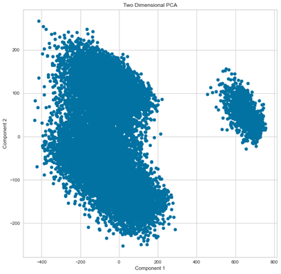
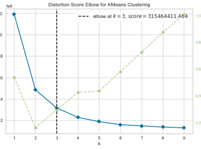
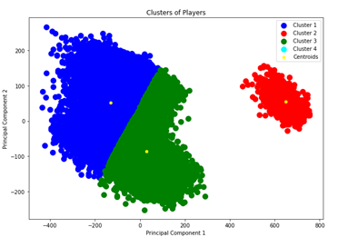
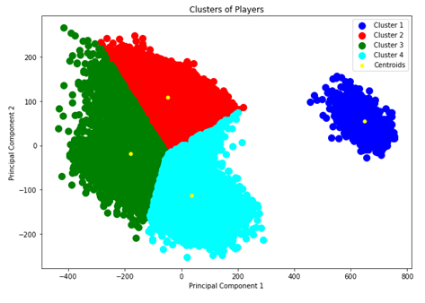
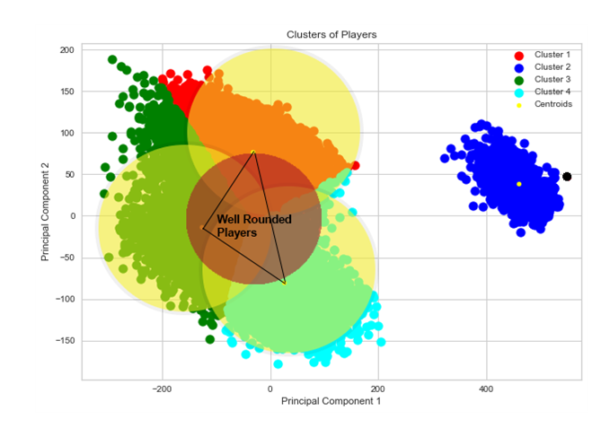

# FIFA 21 PCA, Clustering and Predictive Modeling
## Hofstra University Graduate Business Analytics and Data Mining Course Final Project Fall 2020
### Summary
  In this project, my goal is to showcase the Data Mining and Preprocessing techniques I have spent the last several months researching and practicing and put them to use. I use the FIFA 21 dataset which is found on [Kaggle](https://www.kaggle.com/ekrembayar/fifa-21-complete-player-dataset). 
  
  Data Preprocessing is an integral step that took up about 60% of the time in this project. It started with dropping problematic variables, and lead to some functional data cleaning of object types to numeric (ie. Value observation of '€625K' to 625000).
  
  Feature Engineering in this project was composed of two parts -  1. Creating variables that connote the general position of a player relative to their Best Position (BP) and 2. created a variable for BMI (body mass index) with the given height and weight observations for each player.
  
 I begin modeling with a Principal Component Analysis of the data. I then perform K-Means clustering on two PCA dimensions which leads me to some very interersting discoveries upon which I elaborate further in the results section. 
 
 In terms of predictive modeling, my target variable in this project is 'Value', which is the monetary worth of a player. I chose Linear Regression, Random Forest Regression and Neural Network predicitve models in this project. Predicting 'Value' can lead us further into more detailed player analysis that can potentially help us capitalize on stars, current or future.
  
I use both Python (Jupyter Notebook) and R in my analysis.

# Python
  In the IPYNB notebook, I've preprocessed the FIFA 21 data upon which I attempt to run a Linear Regression model and a Random Forest Regressor model to predict 'Value'. Before that, however, I run a Principal Component Analysis and K-Means Clustering. My Results are the following:
## PCA + Clustering Results
  I projected the variables onto two PCA dimensions in an effort to visualize them on a 2D graph, and so I created Figure 1, the PCA graph. Looking at Figure 1, we can see that most of the variables scatter together. However, we can also see that there is a smaller scatter of variables that is out on its own.
I wanted to make more sense of these scatter patterns, so I performed K-Means clustering. The distortion score Elbow method (Figure 2) showed me that I needed at least three clusters - Figure 3 shows these clusters. In discerning these clusters, I found that they tend to form around the four general positions in soccer (GPOS, a variable I created in the dataset). So, I changed my value of K to 4, one for each position. Figure 4 shows the four clusters. The results I found were that most midfielders in the dataset are attacking oriented. I, of course, could have kept clustering all the way to K=24 to see if the clusters form around each of the 24 positions in the game, but I decided to dig into the four clusters first.
Looking at the neighboring 3 clusters and how they formed, I was intrigued in seeing that the area between the centroids was sort of a ‘middle ground’ between them. The features I fed into this model would tell me that well rounded players would reside close to the borders of the 3 clusters. I wanted a better to visualize this so I came up with Figure 5, A Venn diagram layover as well as a connection between the three centroids that forms a triangle connoting the general area where a players with those stats would be considered ‘well-rounded’ – that area is defined by the red circle in the middle that overlaps everything as a sort of ‘hot zone’ for that potential player. We could theoretically keep clustering to see which player clusters form in that area.

## Model Results
__Linear Regression:__
+ MAPE: __1.274%__ 
+ Train r2 Score: 96.791% 
+ Test r2 Score: 96.688 
+ Adjusted r2 Score: 97.494% 
+ RMSE: 3570337.072269582 (Inverted value in Euros)
+ MAE: 716693.0674474129 (Inverted value in Euros)
+ Cross Validation Score: 91.488% 

__Random Forest Regressor:__
+ MAPE: __0.61%__
+ Train r2 Score: 99%
+ Test r2 Score: 99%
+ Adjusted r2 Score: 99%
+ RMSE: 1021000.98 (Inverted value in Euros)
+ MAE: 268742.83 (Inverted value in Euros)
+ Cross Validation Score: 97.5%

# R
In the R code, I attempt to run a __Sequential Neural Network model__ with the use of Keras/TensorFlow. The data I use for this is the [(un-normalized) preprocessed data](https://github.com/arvin-ds/FIFA21_PCA_Clustering_and_Predictive_Modeling/blob/main/data/FIFATrain.csv) from the IPYNB file  - the only difference here is I handle the methodical data normalization in RStudio; It seemed more fitting to normalize the data column-wise for the Neural Network model.
## Model Results
__Neural Network:__
+ MAPE: __.5%__
+ Accuracy: __99.5%__

# Figures
## Figure 1
Two PCA Dimensional Scatter Plot

## Figure 2
Distortion Score Elbow for K-Means Clustering

## Figure 3
Three Cluster K-Means

## Figure 4
Four Cluster K-Means

## Figure 5
Four Cluster Venn Diagram/Centroid Connection Diagram

